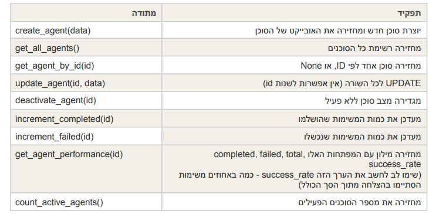
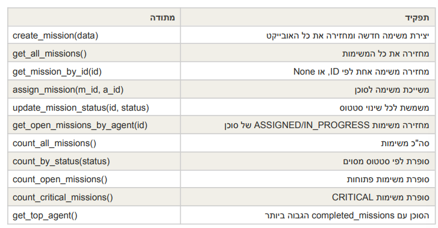
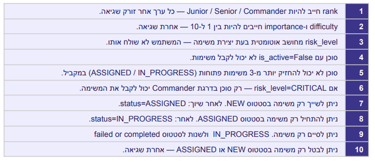
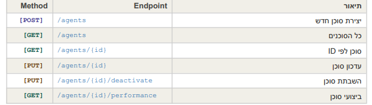
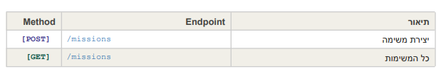
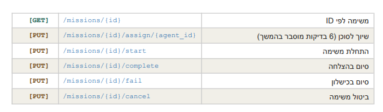
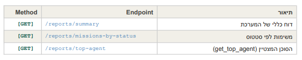

* ###   Intelligence Task Manager 🤫👀🥷 :
---
* ## Description : 📝
* *This system manage database of agents and missions that belongs to each one (meaning each agent), and the goal of this system is 
to manage every small detail about the mission and the agent as well.*
---
---
* ## File structure of the system : 📁
* ### The base structure :
~~~
intelligence-task-manager/
├── database/
│ ├── db_connection.py
│ ├── agent_db.py
│ └── mission_db.py
│
├──logs/
│   ├── logger_config.py
│   └── system.log
│
├── model/
│    ├── agent_model.py
│    └── mission_model.py
│
├──routes/
│ ├── agent_routes.py
│ ├── mission_routes.py
│ └── report_routes.py
│
├── README.md (hy it's me 🙃)
├── requirements.txt
├── .gitignore
└── main.py
~~~
---
---
* ## Table structure 
(tables of data that are in the mysql database) :

* ### Agents table :
---
```
Field:              |Type:                  |Comments: |
id                  |int, auto_increment,PK | unique id 
name                |varchar                | agent name
specialty           |varchar                | which field
is_active           |boolean                | defoalt True
completed_missions  |int                    | defoalt 0
failed_missions     |int                    | defoalt 0
agent_rank          |enum/varchar           | only*

*(Junior / Senior / Commander)
```
---

* ### Mission table :
---
Field:            |Type:                  |Comments: |
id                |int, auto_increment, PK|unique id
title             |varchar                |mission title
description       |text                   |details
location          |varchar                |mission location 
difficulty        |int                    |1-10 only
importance        |int                    |1-10 only
status            |varchar                |defoalt "new"
risk_level        |varchar                |*
assigned_agent_id |int                    |defoalt null**

*does not come from the user it comes automatically from the system calculation.

**intil the mission assigned to some agent.
---
---
* ## Classes explain :
---
* ### DB_connection class :

The class that connects to mysql database has a method
to create the database itself, and a method that
creates the two tables of data (agent and mission)
into it  meaning this class as three methods in total. 
---
* 1. connection_get() = returns a connection to MYSQL
* 2. database_create() = creates a database if not exists already 
* 3. tables_create() = creates two tables also if they are not exists
---
* ### AgentDB class :

* This class is managing all of the SQL methods that talks,  and
communicate with the data table named agent. 



---
* ### MissionDB class :

* This class is managing the communication with
the mission table.



---
---
* ##  system rules :
---


---
---
* ## How_to_run_it :▶️
---
* ### How to run the docker:
---
*(in the cmd)
~~~
docker run -d --name intelligence-mysql -e MYSQL_ROOT_PASSWORD=1234 
 -e MYSQL_DATABASE=Intelligence_db -p 3306:3306 mysql:8.0

~~~

* ### How to run the DB layer:
---
~~~
py main .py
~~~
---
---
* ## Student : 🧒
---
* ### Name:
Meir Silverman
* ### ID :
212729099
* ### Class :
Golan
---
---
* ### How to run the program :▶️
~~~
git clone https://github.com/meirsilverman2-debug/Intelligence_Task_manager.git
~~~
---
~~~
pip install -r requirements.txt
~~~
---
~~~
uvicorn main:app --reload
~~~
---
---
* ## List of all of the endpoints :
---
* ### Agents endpoints :


---
* ### Missions endpoints :



---
* ### Reports endpoints :




